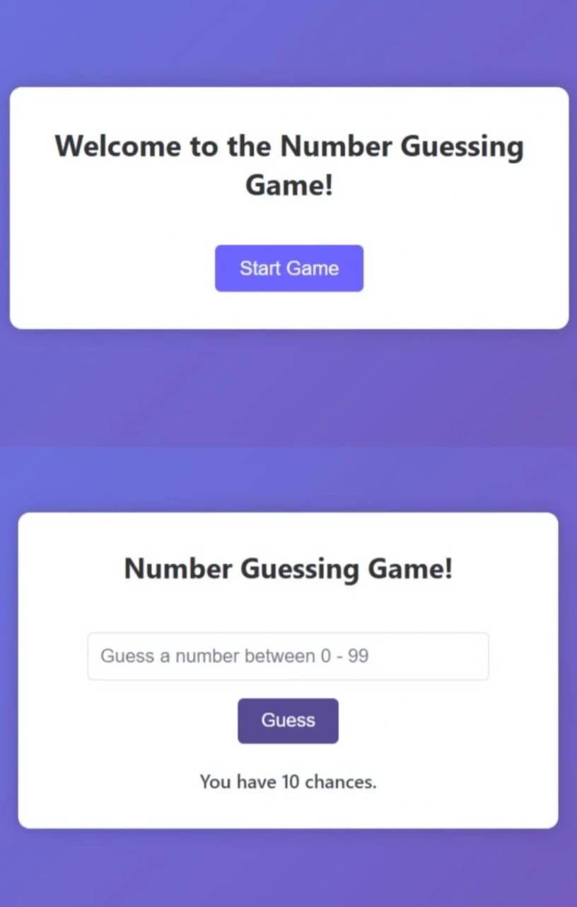

# A-Game: Guess-the-Number
It is a simple and interactive number guessing game built using HTML, CSS, and JavaScript. In this game, the user has to guess a randomly generated number within a specific range (e.g., 1 to 100). With each guess, the game provides feedback — whether the guessed number is too high, too low, or correct — making it both fun and educational! 

## 🕹️ Game Objective

The goal of the game is to guess a randomly generated number between 1 and 100. With each guess, the game provides feedback:
- 🔼 Too high
- 🔽 Too low
- ✅ Correct guess
It's a fun way to test your intuition and logic while practicing basic web development!

## 🚀 How to Play

1. Open the game in your browser (`index.html`).
2. Enter a number between 1 and 100.
3. Click **Guess**.
4. Read the feedback and continue until you guess the correct number!

## 🛠️ Built With

- HTML5
- CSS3
- Vanilla JavaScript

## 📌 Features

- Random number generation
- Instant feedback on each guess
- Clean and responsive design
- Educational and fun!

##  🔗 Live Demo
🌐 [Click here to play the game](https://sakshi123509.github.io/A-Game-Guess-the-Number/)

## 📸 Preview

Made with 💻 by [Sakshi123509](https://github.com/Sakshi123509)

